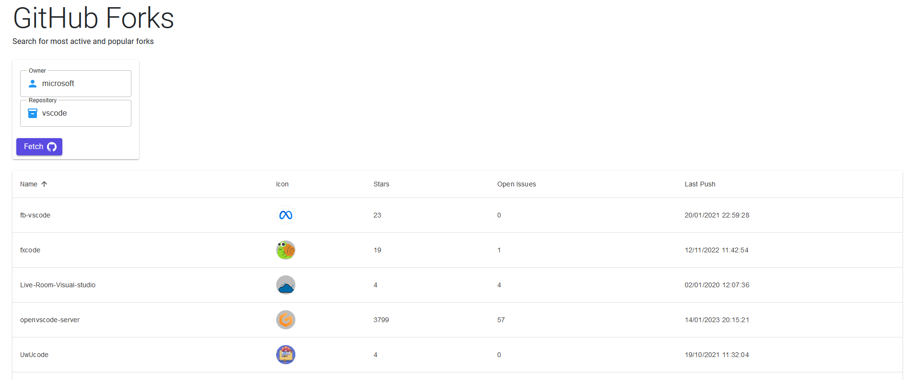

# GitHubActiveForks

<!-- ABOUT THE PROJECT -->
## About The Project

Small project to view active forks in a github repository




### Built With

This small project was a first hand on experience with blazor and MudBlazor UI framework

[![Blazor][Blazor]][Blazor-url]

### Usage

build and run locally or use the following url

  ```sh
  tbd (hosted on cloud later)
  ```


[Blazor]: https://img.shields.io/badge/Blazor-blueviolet?style=for-the-badge&logo=blazor&logoColor=white
[Blazor-url]: https://learn.microsoft.com/en-us/aspnet/core/blazor/
